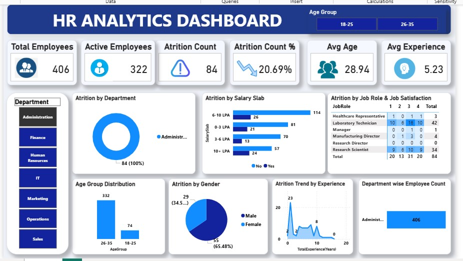

# 📊 HR Analytics Dashboard | Power BI

An interactive **HR Analytics Dashboard** developed using **Power BI** and **Microsoft Excel** to analyze workforce data and generate meaningful business insights. This project demonstrates the complete Business Intelligence workflow, including data cleaning, data transformation, DAX calculations, and dashboard development.

---

# 📸 Dashboard Preview

## Main Dashboard


---

# 📖 Project Overview

The HR Analytics Dashboard provides valuable insights into employee attrition, workforce demographics, salary distribution, job satisfaction, and departmental performance. It enables HR professionals and business leaders to make data-driven decisions through interactive visualizations.

---

# 🚀 Project Workflow

## 📥 Data Collection
- Downloaded the HR Analytics dataset.
- Imported the dataset into Microsoft Excel.

## 🧹 Data Cleaning
- Removed duplicate records.
- Checked missing values.
- Standardized data formats.
- Prepared the dataset for analysis.

## 🔄 Data Transformation
- Imported the cleaned dataset into Power BI.
- Performed data transformation using Power Query.
- Optimized the data model.

## 📊 DAX Measures Created

- Total Employees
- Active Employees
- Attrition Count
- Attrition Rate (%)
- Average Age
- Average Experience

## 📈 Dashboard Development

Built an interactive HR dashboard using Power BI with KPI cards, slicers, charts, and business insights.

---

# 📊 Dashboard Features

✅ Total Employees

✅ Active Employees

✅ Attrition Count

✅ Attrition Rate

✅ Average Employee Age

✅ Average Experience

✅ Department-wise Attrition Analysis

✅ Salary Slab Analysis

✅ Job Satisfaction Matrix

✅ Age Group Distribution

✅ Gender Distribution

✅ Attrition Trend by Experience

✅ Department-wise Employee Count

✅ Interactive Department Filter

✅ Interactive Age Group Filter

---

# 📷 Dashboard Screenshots

## Department-wise Attrition



---

## Age Group Analysis


---

# 💡 Business Insights

- Identified departments with the highest employee attrition.
- Compared employee distribution across salary slabs.
- Analyzed workforce demographics.
- Evaluated employee experience trends.
- Examined job satisfaction across various job roles.
- Built an interactive dashboard for HR decision-making.

---

# 🛠️ Tools & Technologies

- Microsoft Power BI
- Microsoft Excel
- Power Query
- DAX (Data Analysis Expressions)

---

# 📂 Repository Structure

```
HR-Analytics-Dashboard/
│
├── HR Analytics Dashboard.pbix
├── HR_Analytics-Data.csv
├── Dashboard Image.jpg
├── Administration.jpg
├── Age wise.jpg
└── README.md
```

---

# 🎯 Skills Demonstrated

- Data Cleaning
- Data Transformation
- Power Query
- DAX
- Data Visualization
- Dashboard Design
- Business Intelligence
- HR Analytics
- Interactive Reporting

---

# 🔮 Future Improvements

- Employee Attrition Prediction
- Drill-through Reports
- Employee-Level Dashboard
- Advanced DAX Measures
- Forecasting & Trend Analysis

---

# 👨‍💻 Author

## Sujal More

🔗 **LinkedIn**

https://www.linkedin.com/in/sujal-more/

💻 **GitHub**

https://github.com/sujalmore21

---

## ⭐ If you found this project useful, please consider giving it a Star!
